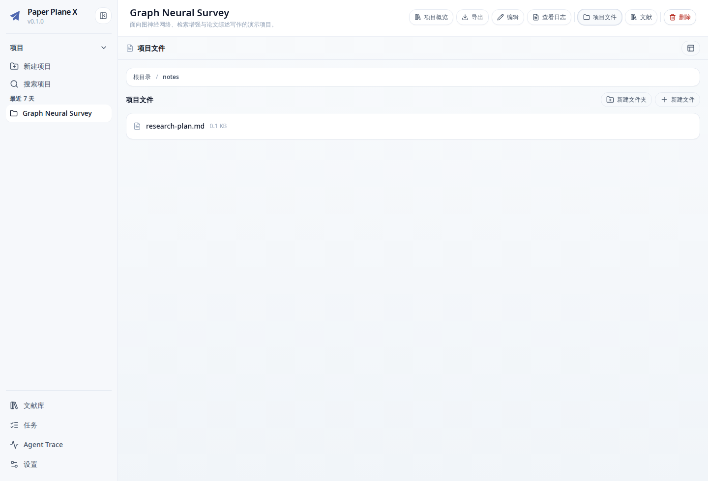
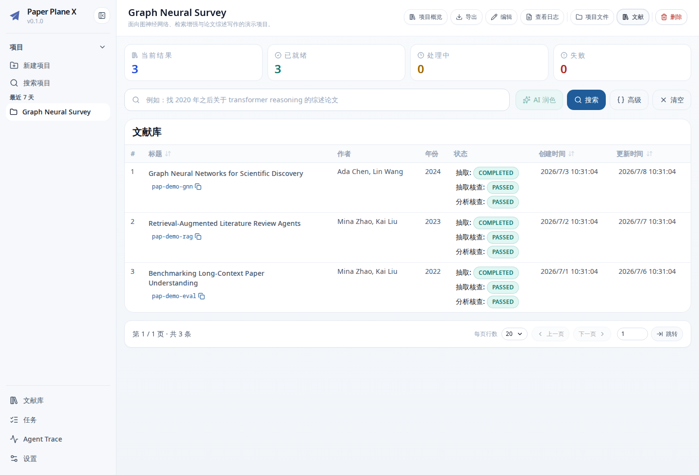
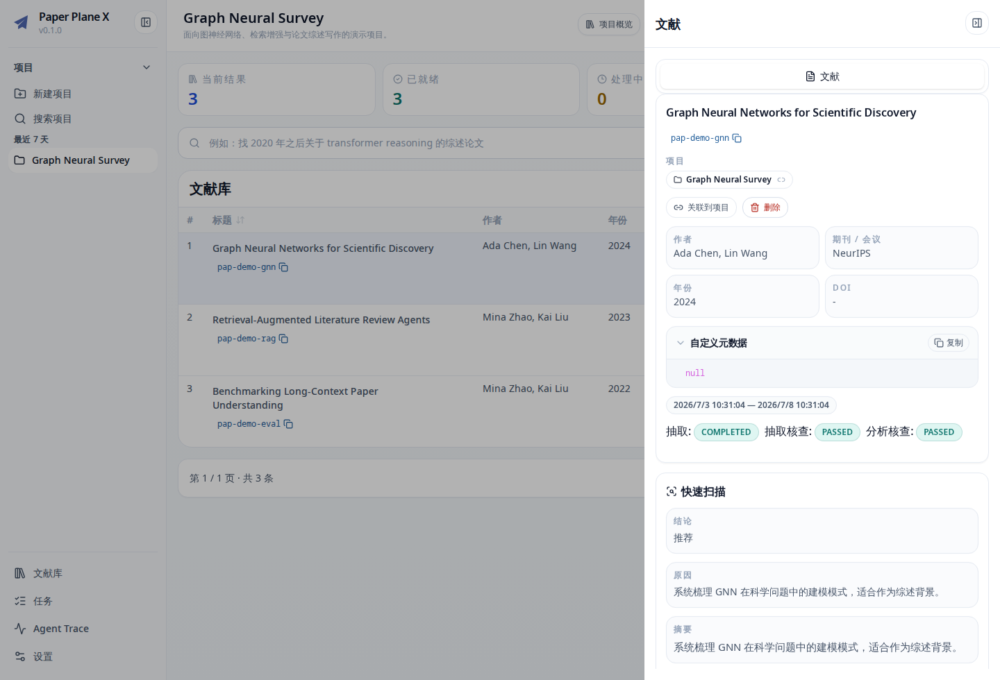
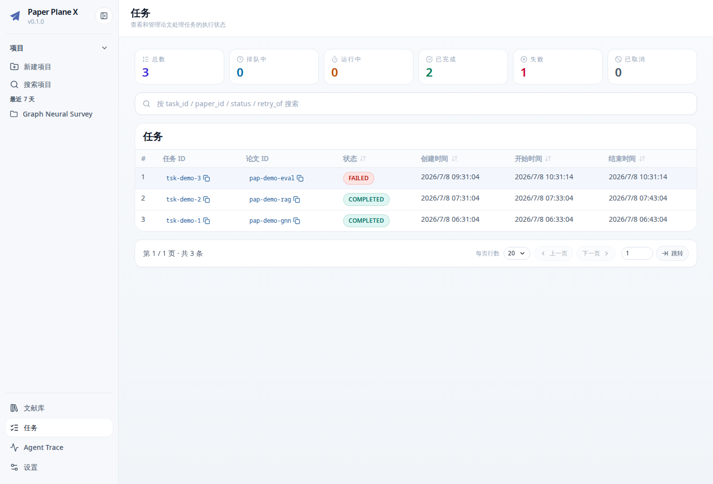
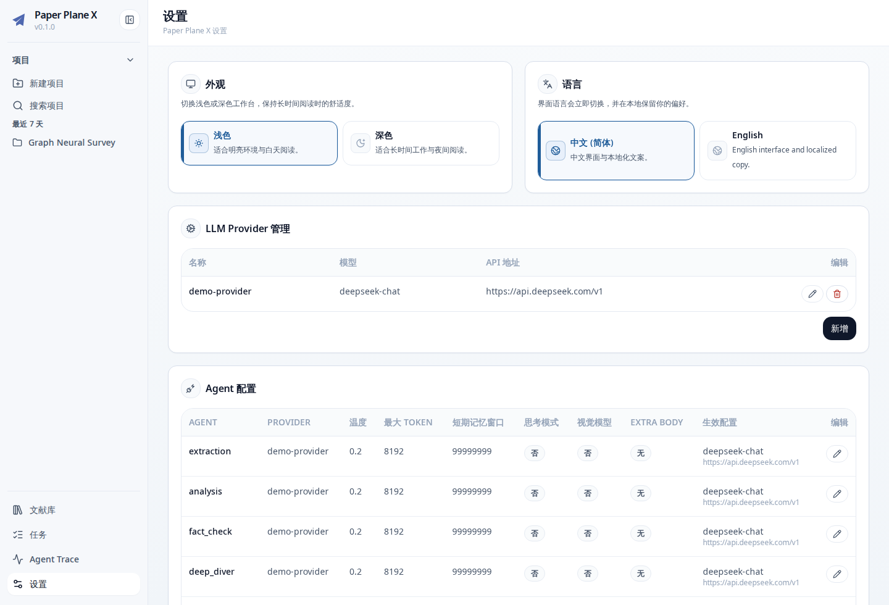

# Paper Plane X

Paper Plane X 是一个面向科研阅读、论文处理和综述写作的本地优先工作台。它把 PDF 解析、结构化论文抽取、事实核查、项目文件、文献检索和外部 Agent 工具串成一条可复用的研究流水线。

你可以用它做这些事：

- 把论文 PDF 上传到后端，解析为 Markdown，并抽取 quick scan、方法、结果、理论分析等结构化字段。
- 按项目管理论文、笔记、草稿和导出文件。
- 在文献库中搜索、筛选、查看单篇论文详情。
- 用 Librarian 在项目或全库范围内检索论文、拉取对比矩阵、做单篇 deep dive。
- 通过 `ppx` CLI 和 `ppx-researcher` skill，让 Codex、Claude Code、Pi agent 等外部 Agent 读写项目文件、查询论文和沉淀研究结果。
- 通过 Zotero 插件把文献管理器里的论文送入 Paper Plane X。

## Web 预览

项目文件页：项目级笔记、草稿和中间产物集中管理。



文献列表：查看项目论文、处理状态和基础元数据。



论文详情：查看 quick scan、结构化抽取、分析报告和 paper note。



任务监控与设置：





## 组件

| 目录                      | 作用                                                                             | 适合谁                        |
| ------------------------- | -------------------------------------------------------------------------------- | ----------------------------- |
| `paper_plane_x_backend/`  | FastAPI 后端，提供 PDF 解析、论文处理、Librarian、Project files、Settings 等 API | 本地运行、部署、脚本调用      |
| `paper_plane_x_frontend/` | Vue 3 Web 控制台，连接后端 API                                                   | 日常使用者                    |
| `paper_plane_x_cli/`      | `ppx` HTTP CLI 与外部 Agent skills                                               | 命令行用户、自动化脚本、Agent |
| `paper_plane_x_zotero/`   | Zotero 7 插件                                                                    | Zotero 用户                   |

后端是核心服务。前端、CLI 和 Zotero 插件都通过后端 HTTP API 工作。

## 前置依赖

非 Docker 模式运行后端、开发 Python 项目、安装 CLI 都依赖 [uv](https://docs.astral.sh/uv/)。如果本机还没有 uv，先按官方文档安装：

```bash
curl -LsSf https://astral.sh/uv/install.sh | sh
```

Docker 模式只需要 Docker / Docker Compose。前端开发需要 Node.js 和 pnpm；Zotero 插件开发需要 Node.js 和 npm。

## 安装和启动

### 非 Docker 模式

如果你想直接用 Python 运行后端，请 clone 整个仓库。后端可以独立启动，但 Web 控制台的构建产物来自前端项目或 GitHub Release。

```bash
git clone <repo-url>
cd paper_plane_x
cd paper_plane_x_backend
uv sync
cp .env.example .env
uv run app
```

健康检查：

```bash
curl -s http://127.0.0.1:8000/health
```

浏览器打开：

```text
http://127.0.0.1:8000/docs
```

如果你愿意本地编译 Web 控制台：

```bash
cd paper_plane_x
just build-console
cd paper_plane_x_backend
uv run app
```

如果你不想本地编译 Web 控制台，可以从 GitHub Release 下载 `paper-plane-x-console-vX.Y.Z.tar.gz`，解压到后端默认 console 目录：

```bash
cd paper_plane_x_backend
mkdir -p data/console
tar -xzf ~/Downloads/paper-plane-x-console-vX.Y.Z.tar.gz -C data/console
uv run app
```

然后打开：

```text
http://127.0.0.1:8000
```

### Docker 模式

发布版 Docker image 已经内置 Web 控制台。你可以在任意目录自己创建 `docker-compose.yml`：

```yaml
services:
  backend:
    image: ghcr.io/<owner>/paper-plane-x-backend:<version>
    container_name: paper-plane-x-backend
    environment:
      - PPX_API__HOST=0.0.0.0
    ports:
      - "8000:8000"
    volumes:
      - ./data:/app/data
    restart: unless-stopped
```

启动：

```bash
docker compose up
```

如果你已经 clone 了仓库，也可以直接使用我们提供的发布 compose：

```bash
cd paper_plane_x_backend
GHCR_OWNER=<owner> PPX_VERSION=0.1.0 docker compose -f docker-compose.release.yml up
```

默认访问：

```text
http://127.0.0.1:8000
```

### CLI

`ppx` CLI 发布到 PyPI 后，可以通过 uv 直接安装：

```bash
uv tool install paper-plane-x-cli
```

升级：

```bash
uv tool upgrade paper-plane-x-cli
```

卸载：

```bash
uv tool uninstall paper-plane-x-cli
```

### Zotero 插件

Zotero 插件会作为 GitHub Release asset 发布。下载 `paper-plane-x.xpi` 后，在 Zotero 中安装：

```text
Zotero -> Tools -> Plugins -> Install Plugin From File
```

### 前端开发模式

如果想要开发 Web 控制台，请再单独启动前端开发服务器：

```bash
cd paper_plane_x_frontend
pnpm install
cp .env.example .env
pnpm dev
```

默认访问：

```text
http://127.0.0.1:5173
```

## 首次配置

进入前端 Settings 页面，完成：

1. 添加 LLM Provider。
2. 将 `extraction`、`analysis`、`fact_check`、`deep_diver`、`query_builder`、`global_finder` 绑定到 Provider。
3. 配置 PDF Parser。如果使用本地 [MinerU](https://opendatalab.github.io/MinerU/)，先确认 MinerU 服务地址可访问；源码见 [opendatalab/MinerU](https://github.com/opendatalab/MinerU)。

没有 LLM Provider 时，可以创建项目和上传文件，但自动论文抽取、分析、deep dive 等 Agent 能力不能完整运行。

## 典型工作流

1. 在前端创建一个项目。
2. 上传 PDF 到文献库，等待 data-process 任务完成。
3. 将论文关联到项目。
4. 在项目文献页查看 quick scan、处理状态和结构化字段。
5. 在项目文件页保存研究计划、对比矩阵和综述草稿。
6. 使用 Librarian 搜索论文、拉取字段矩阵或做单篇 deep dive。
7. 使用 `ppx` CLI 或外部 Agent skill 自动整理结果。

CLI 示例：

```bash
uv tool install paper-plane-x-cli

ppx context set --base-url http://127.0.0.1:8000/api/v1 --project-id prj_x
ppx project global-finder
ppx librarian search --query-expr "(quick_scan.tags CONTAINS 图神经网络)"
ppx librarian matrix --paper-ids pap_a,pap_b --field-paths meta.title,quick_scan.quick_summary
ppx files upload --source ./notes.md --path /notes/notes.md
```

## Agent 阅读论文效果

安装 CLI skills 后，Codex、Claude Code、Pi agent 等外部 Agent 可以通过 `ppx` 访问同一个 Paper Plane X 项目。它不会直接读数据库，也不会猜测论文内容；它会先调用后端 API 获取证据，再把可复用结果写回项目文件或 paper note。

安装 CLI 和 skills：

```bash
uv tool install paper-plane-x-cli
ppx skills install
```

如果你的 Agent 使用其他 skills 目录，也可以显式指定：

```bash
ppx skills install --target-dir ~/.agents/skills
ppx skills install --target-dir ~/.claude/skills
ppx skills install --target-dir ./.claude/skills
```

设置项目上下文：

```bash
ppx context set --base-url http://127.0.0.1:8000/api/v1 --project-id prj_x
```

然后可以直接对 Agent 说：

```text
请使用 ppx-researcher 帮我梳理这个项目里关于图神经网络的论文，比较它们的核心方法、数据集、指标和局限，并把结果写入 /notes/gnn-comparison.md。
```

一次典型执行会像这样发生：

1. Agent 运行 `ppx context show` 确认后端和项目。
2. 用 `ppx project global-finder` 查看项目有哪些论文。
3. 用 `ppx librarian search` 搜索相关论文。
4. 用 `ppx librarian matrix` 拉取标题、quick scan、方法、实验结果等结构化字段。
5. 对关键论文调用 `ppx librarian deep-dive` 做定向追问。
6. 用 `ppx files upload/write/patch` 把对比表、综述段落或阅读计划写入项目文件。
7. 对单篇论文的稳定结论，用 `ppx paper-note write` 写入 paper note。

适合交给 Agent 的任务：

- “找出项目里最值得精读的 5 篇论文，并说明理由。”
- “比较这些论文的实验设置，生成一个 Markdown 表格。”
- “读取 `pap_x` 的完整 Markdown，解释核心公式和算法流程。”
- “基于当前项目文件，续写 Related Work 草稿。”
- “把这篇论文的局限和可复用观点写入 paper note。”

## 日常开发命令

仓库提供 `justfile`：

```bash
just backend dev
just frontend dev
just backend test
just frontend build
just pre-commit
```

也可以进入子项目运行：

```bash
cd paper_plane_x_backend && just test
cd paper_plane_x_frontend && just build
cd paper_plane_x_cli && just lint
```

## 发布

CI 位于 `.github/workflows/ci.yml`，会检查 backend、frontend、CLI、版本同步和 Docker 镜像构建。

发布使用 tag 触发：

```bash
python scripts/sync_version.py --set 0.1.1
git add VERSION paper_plane_x_backend/pyproject.toml paper_plane_x_cli/pyproject.toml paper_plane_x_frontend/package.json paper_plane_x_zotero/package.json paper_plane_x_zotero/package-lock.json
git commit -m "Release 0.1.1"
git tag v0.1.1
git push origin main v0.1.1
```

Release workflow 会：

- 构建并推送带 Web 控制台的 backend 镜像到 GHCR。
- 构建 frontend/console 压缩包并附到 GitHub Release。
- 构建 `paper-plane-x-cli` 并发布到 PyPI，供用户 `uv tool install paper-plane-x-cli`。
- 构建 Zotero 插件 `.xpi` 和 `update*.json`，并附到 GitHub Release。

首次发布 CLI 前，需要在 PyPI 为 `paper-plane-x-cli` 配置 GitHub Actions Trusted Publisher，环境名为 `pypi`，workflow 为 `.github/workflows/release.yml`。

## 更多文档

- [Backend README](paper_plane_x_backend/README.md)
- [Frontend README](paper_plane_x_frontend/README.md)
- [CLI README](paper_plane_x_cli/README.zh.md)
- [Backend Quickstart](paper_plane_x_backend/docs/workflow_quickstart.md)
- [Librarian Guide](paper_plane_x_backend/docs/librarian.md)
- [Project Conventions](PROJECT_CONVENTIONS.md)

## 版本

版本号由根目录 `VERSION` 统一维护：

```bash
python scripts/sync_version.py --set 0.1.1
```
