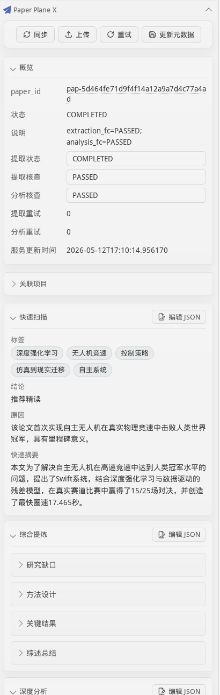
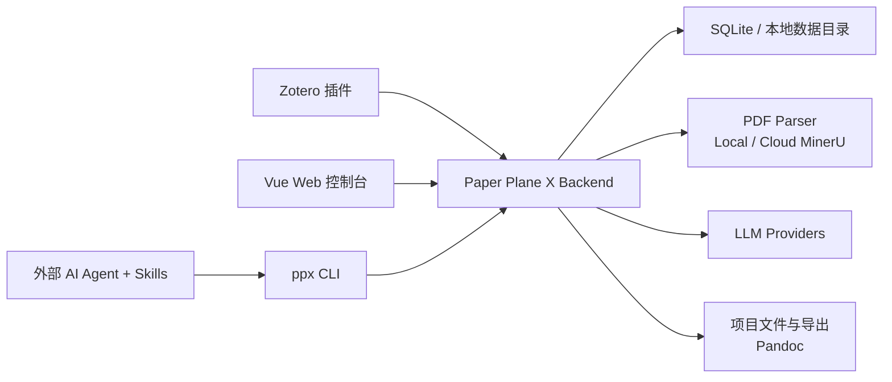

# Paper Plane X

[](https://github.com/WindLX/paper_plane_x/actions/workflows/ci.yml)
[](https://github.com/WindLX/paper_plane_x/releases/latest)
[](https://pypi.org/project/paper-plane-x-cli/)
[](LICENSE)

Paper Plane X 是一个面向科研阅读、论文处理和综述写作的本地优先研究工作台。它将 Zotero 文献管理、PDF 解析、结构化论文抽取、事实核查、项目文件、文献检索和外部 AI Agent 串成一条可复用、可追踪的研究流水线。

项目适合希望保留本地数据控制权，同时让 AI 基于真实论文证据辅助阅读、比较和写作的研究者与开发者。

## 核心能力

- **论文处理流水线**：将 PDF 解析为 Markdown，并生成 quick scan、综合提炼、深度分析与事实核查结果。
- **项目化研究空间**：集中管理论文、笔记、草稿、对比矩阵和导出文件。
- **文献检索与比较**：通过 Librarian 搜索论文、提取字段矩阵并对单篇论文进行深度分析。
- **Zotero 集成**：从 Zotero 上传 PDF、查看处理状态、关联项目并浏览结构化分析结果。
- **Web 控制台**：管理项目、文献库、后台任务、Agent traces 和运行时设置。
- **CLI 与 Agent Skills**：让 Codex、Claude Code、Pi agent 等工具通过受控 API 查询论文并将结果写回项目。
- **本地优先**：核心数据默认存储在本地 SQLite 和项目数据目录中；模型与解析服务由用户自行配置。

## 界面预览

### 项目文件

在项目级沙箱中管理研究计划、笔记、数据文件和综述草稿，并导出 Markdown、HTML、DOCX 或 PDF。


### 文献库与论文详情

浏览论文状态和元数据，查看 quick scan、综合提炼、深度分析、事实核查和 Agent 备注。


### 任务与设置

跟踪后台处理任务，并配置 LLM Provider、Agent、PDF Parser、Pandoc 和运行参数。


### Zotero 插件

在 Zotero 右侧面板直接查看 Paper Plane X 的处理状态和结构化研究结果。



## 系统架构



后端是系统的唯一业务入口。前端、CLI、Zotero 插件和外部 Agent 都通过 `/api/v1` HTTP API 访问数据，不直接读取数据库。

## 仓库结构

本仓库是协调发布与集成测试的顶层仓库，四个组件通过 Git submodule 管理：

| 目录                                                          | 组件                                 |
| ------------------------------------------------------------- | ------------------------------------ |
| [`paper_plane_x_backend/`](paper_plane_x_backend/README.md)   | FastAPI 后端、任务处理、数据库与 API |
| [`paper_plane_x_frontend/`](paper_plane_x_frontend/README.md) | Vue 3 Web 控制台                     |
| [`paper_plane_x_cli/`](paper_plane_x_cli/README.zh.md)        | `ppx` HTTP CLI 与 Agent Skills       |
| [`paper_plane_x_zotero/`](paper_plane_x_zotero/README.md)     | Zotero 7+ 插件                       |

## 面向用户：安装与运行

### 方式一：Backend + Web Console（推荐）

要求：Git、Python 3.12+ 和 [uv](https://docs.astral.sh/uv/)。这种方式无需安装 Node.js，也无需克隆完整 monorepo。

```bash
git clone https://github.com/WindLX/paper_plane_x_backend.git
cd paper_plane_x_backend
uv sync
cp .env.example .env
mkdir -p data/console
```

从 [Paper Plane X 最新 Release](https://github.com/WindLX/paper_plane_x/releases/latest) 下载 `paper-plane-x-console-vX.Y.Z.tar.gz`，然后解压到 backend 的 `data/console/`：

```bash
tar -xzf paper-plane-x-console-vX.Y.Z.tar.gz -C data/console
uv run app
```

打开 `http://127.0.0.1:8000`。后端会直接托管 Web Console，API 文档位于 `http://127.0.0.1:8000/docs`。

升级时先停止服务、更新 backend，再用新 Release 中的 console 完整替换 `data/console/`。数据库、论文和设置位于 `data/` 的其他路径，不应随 console 一起删除。

### 方式二：Docker Compose

发布镜像已包含 Web 控制台。准备一个空目录并创建 `docker-compose.yml`：

```yaml
services:
  backend:
    image: ghcr.io/windlx/paper-plane-x-backend:latest
    container_name: paper-plane-x-backend
    environment:
      PPX_API__HOST: 0.0.0.0
    ports:
      - "8000:8000"
    volumes:
      - ./data:/app/data
    restart: unless-stopped
```

启动服务：

```bash
docker compose up -d
```

打开 `http://127.0.0.1:8000`。发布镜像已经内置对应版本的 Web Console。

若已克隆本仓库，也可以使用随项目提供的发布配置：

```bash
GHCR_OWNER=windlx PPX_VERSION=latest \
  docker compose -f paper_plane_x_backend/docker-compose.release.yml up -d
```

### 方式三：从 monorepo 源码运行

要求：Git、Python 3.12+、[uv](https://docs.astral.sh/uv/)、Node.js 24、pnpm 和 [just](https://github.com/casey/just)。

```bash
git clone --recursive https://github.com/WindLX/paper_plane_x.git
cd paper_plane_x
just setup
cp paper_plane_x_backend/.env.example paper_plane_x_backend/.env
just build-console
just backend dev
```

如果克隆时漏掉 submodule：

```bash
git submodule update --init --recursive
```

### 安装 CLI

推荐使用 uv 从 PyPI 安装隔离的命令行工具：

```bash
uv tool install paper-plane-x-cli
ppx --help
```

升级：

```bash
uv tool upgrade paper-plane-x-cli
```

### 安装 Zotero 插件

推荐访问 [Zotero 中文社区插件商店](https://zotero-chinese.github.io/plugins/)，搜索 **Paper Plane X** 并直接安装。

也可以从 [最新 Release](https://github.com/WindLX/paper_plane_x/releases/latest) 下载 `paper-plane-x.xpi`，然后在 Zotero 的 `Tools → Plugins → Install Plugin From File` 中手动安装。

安装后，在 `Zotero Settings → Paper Plane X` 中填写后端地址，例如 `http://127.0.0.1:8000`；不要附加 `/api/v1`。

详见 [Zotero 插件 README](paper_plane_x_zotero/README.md)。

## 首次配置

启动服务后，在 Web 控制台的 **Settings** 页面完成：

1. 添加至少一个 LLM Provider。
2. 为 `extraction`、`analysis`、`fact_check`、`deep_diver`、`query_builder` 和 `global_finder` 绑定 Provider。
3. 配置 PDF Parser：使用本地 MinerU 服务或 MinerU Cloud。
4. 如需导出 DOCX、HTML 或 PDF，配置 Pandoc 路径、HTML 模板和可选 PDF engine。
5. 根据机器资源调整 Data Process worker 和任务超时。

没有配置 LLM Provider 时，项目和文件管理仍可使用，但自动抽取、分析和 deep dive 无法完整运行。

不要把 API key 提交到 Git。运行时密钥保存在后端数据目录的动态设置文件中，生产部署应同时保护数据卷和备份。

## 推荐研究工作流

1. 在 Web 控制台创建研究项目。
2. 通过 Zotero 插件或 Web 文献库上传带 PDF 附件的论文。
3. 在 Tasks 页面等待 PDF 解析和 Agent 处理完成。
4. 将论文关联到项目，在项目或 Zotero 侧边栏查看结构化结果。
5. 使用 Librarian 搜索相关论文、生成字段矩阵或执行 deep dive。
6. 在项目文件中沉淀研究计划、比较表和综述草稿。
7. 使用 `ppx` CLI 或 Agent Skills 自动查询证据并更新项目文件或 paper note。

示例：

```bash
ppx context set \
  --base-url http://127.0.0.1:8000/api/v1 \
  --project-id prj_x

ppx project global-finder
ppx librarian search --query-expr "(quick_scan.tags CONTAINS 图神经网络)"
ppx librarian matrix \
  --paper-ids pap_a,pap_b \
  --field-paths meta.title,quick_scan.quick_summary
ppx files upload --source ./notes.md --path /notes/notes.md
```

### 让外部 Agent 使用项目文献

```bash
ppx skills install
```

安装后可向 Agent 提出类似任务：

```text
请使用 ppx-researcher 梳理当前项目中关于图神经网络的论文，比较核心方法、数据集、指标和局限，并将结果写入 /notes/gnn-comparison.md。
```

Agent Skill 要求先通过 CLI/API 获取证据，再生成结论并写回项目，避免绕过后端或凭空补全论文内容。

## 面向开发者

### 常用命令

```bash
just setup        # 安装四个组件的依赖
just test         # 运行全部测试
just lint         # 运行全部 lint
just build        # 构建全部组件
just pre-commit   # 执行提交前检查

just backend dev
just frontend dev
just build-console
```

也可以进入子仓库执行其 `justfile` 中的组件命令。

### 配置约定

- 根目录 [`VERSION`](VERSION) 是发布版本的唯一来源。
- 后端启动配置来自 TOML、`.env` 和 `PPX_*` 环境变量。
- 前端开发配置使用 `VITE_API_BASE_URL`；后端托管时由运行时配置注入。
- 本地配置、API key、数据库、解析产物和构建目录不得提交。
- 路由、命令或配置契约变更时，应在同一个 PR 中更新对应 README 或详细文档。

更多约定见 [PROJECT_CONVENTIONS.md](PROJECT_CONVENTIONS.md)。

## 贡献与 Pull Request

欢迎提交问题、文档改进和代码贡献。提交前请：

1. 先搜索 [Issues](https://github.com/WindLX/paper_plane_x/issues)，确认问题没有重复。
2. 从最新 `main` 创建范围明确的分支。
3. 为行为变更补充或更新测试。
4. 更新受影响的 README、API 文档或配置示例。
5. 在受影响仓库运行 `just pre-commit`。
6. PR 描述应说明动机、主要改动、验证命令；UI 变化请附截图。

由于组件是独立 submodule，推荐流程如下：

- **只修改顶层文档、CI 或发布编排**：直接向本仓库提交 PR。
- **修改组件代码**：先向对应子仓库提交 PR；合并后，在顶层仓库更新 submodule 指针并提交第二个 PR。
- 不要让顶层 PR 指向只有个人 fork 可见、尚未合并的 submodule commit。

保持 PR 聚焦，不要混入无关格式化、依赖升级或生成文件。

## 版本与发布

Paper Plane X 使用语义化版本号。根目录 `VERSION` 是单一事实来源：

```bash
python scripts/sync_version.py --set X.Y.Z
```

推荐发布流程：

1. 同步版本并运行所有组件的 `just pre-commit`。
2. 提交并推送发生变化的子仓库。
3. 在顶层仓库提交新的 submodule 指针和 `VERSION`。
4. 创建并推送与 `VERSION` 一致的 `vX.Y.Z` tag。

```bash
git tag vX.Y.Z
git push origin main
git push origin vX.Y.Z
```

Release workflow 会构建并发布：

- GHCR 后端镜像（内置 Web 控制台）；
- 供 backend 托管的 Web Console 压缩包；
- PyPI 上的 `paper-plane-x-cli`；
- Zotero `.xpi` 与 `update*.json`；
- 顶层 GitHub Release assets。

发布配置见 [`.github/workflows/release.yml`](.github/workflows/release.yml)。

## 文档与支持

- [Backend Quickstart](paper_plane_x_backend/docs/workflow_quickstart.md)
- [Backend Architecture](paper_plane_x_backend/docs/architecture.md)
- [Librarian Guide](paper_plane_x_backend/docs/librarian.md)
- [Logging Conventions](paper_plane_x_backend/docs/logging_conventions.md)
- [Roadmap](paper_plane_x_backend/docs/roadmap.md)
- [Issues](https://github.com/WindLX/paper_plane_x/issues)

提交 Issue 时请提供组件、版本、复现步骤和相关日志，并先移除 API key、访问令牌、论文隐私数据和本地路径中的敏感信息。

## License

Paper Plane X 及本仓库中的四个组件使用 [GNU Affero General Public License v3.0 or later](LICENSE)。分发修改版本或通过网络提供修改后的服务时，请遵守 AGPL-3.0-or-later 的相应义务。
